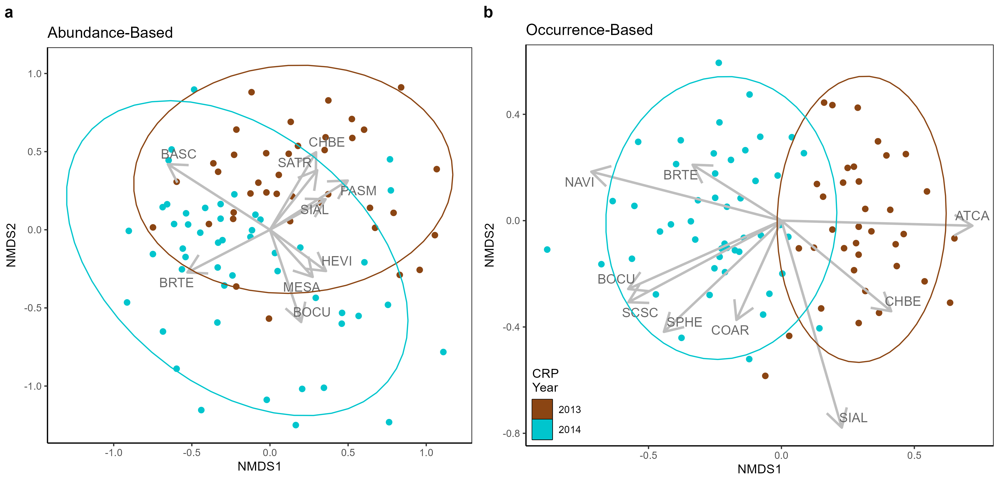
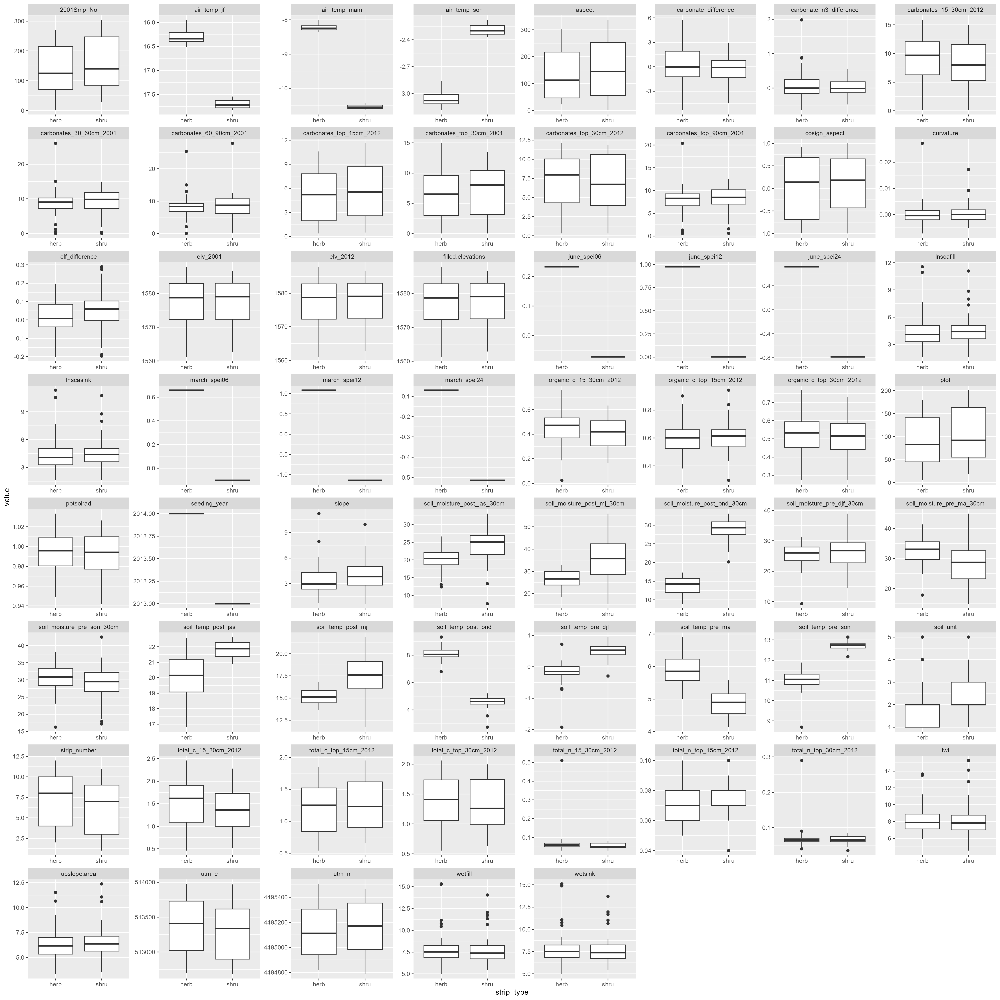
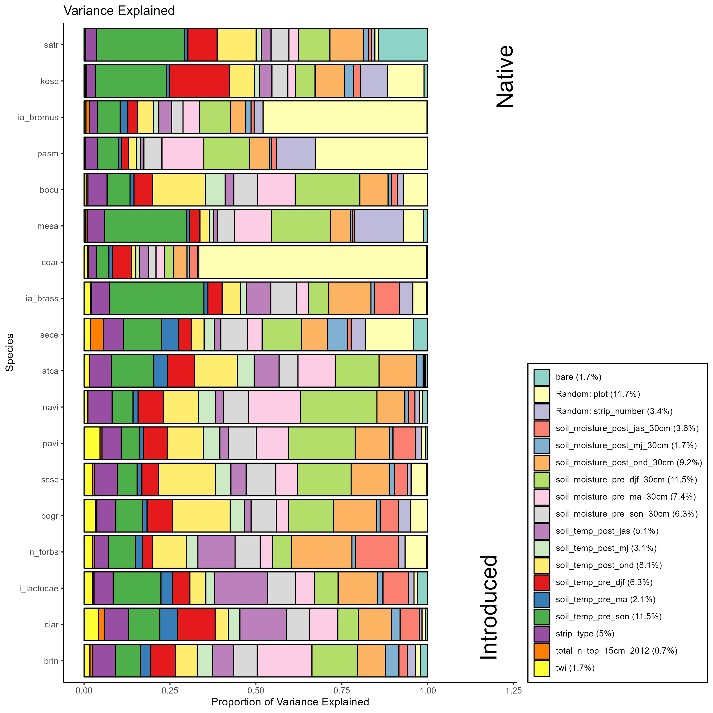
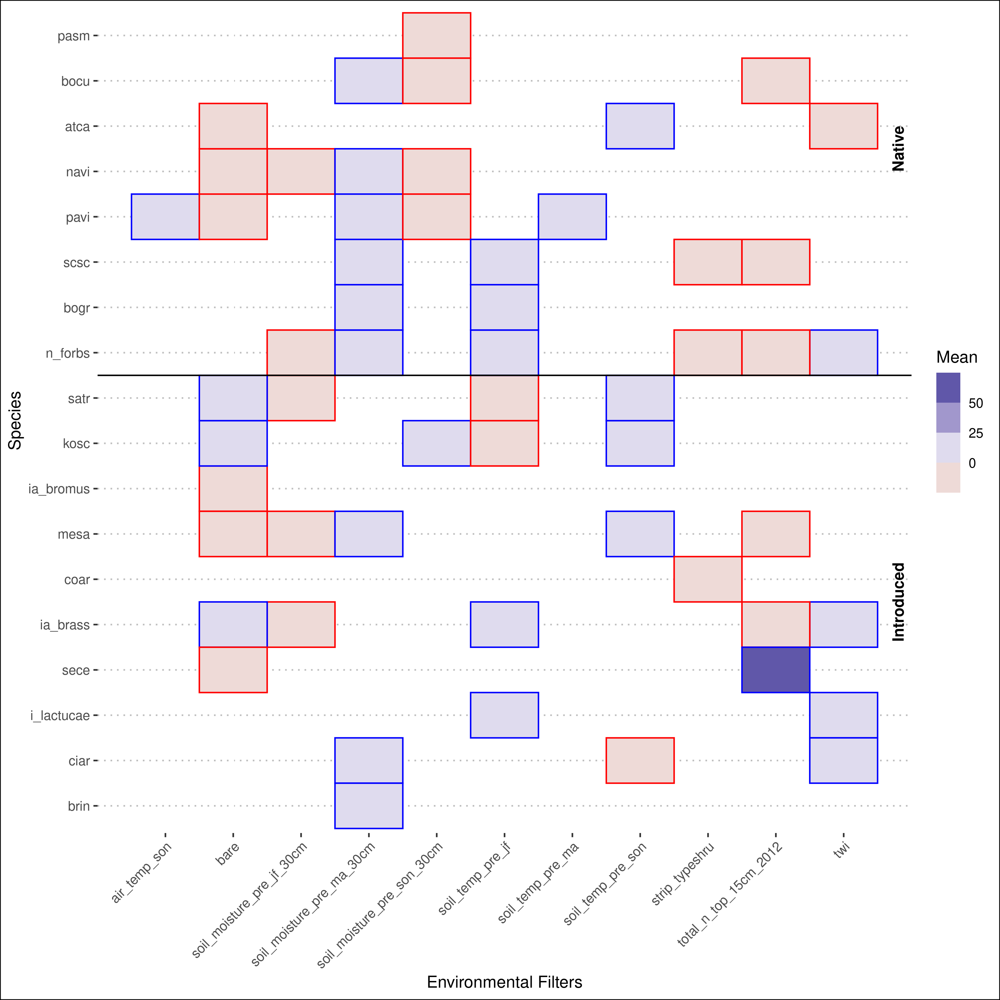
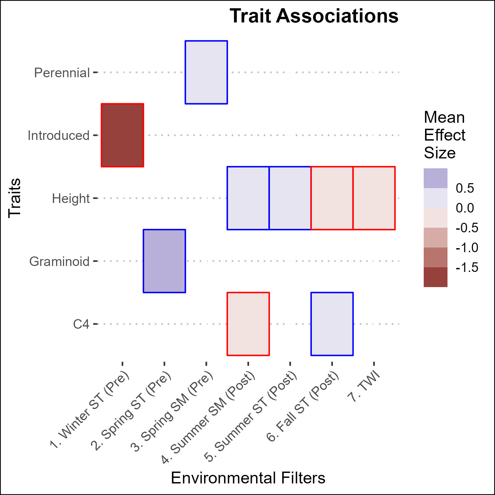

# drake-farm
Trying to understand why the plants are different at Drake Farm.

Google doc:

https://docs.google.com/document/d/1jfntbP9l8SJ_lCLN9DLTrJ3DD738yW-jSBASMX7MWJY/edit?usp=sharing

Google sheets field data sheet

https://docs.google.com/spreadsheets/d/1awV8ANasMfRad5vQhI9-M8T7ct_cxpDPNqSnr4oKk0E/edit?usp=sharing

# current figures

